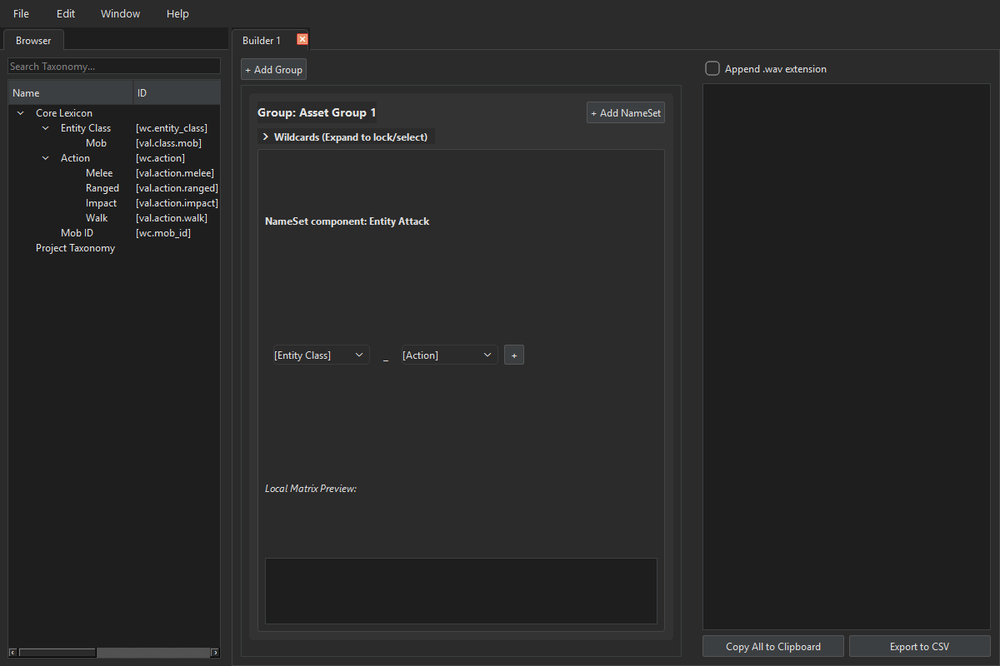

# Ludexicon

**Game Asset Taxonomy Engine**



Ludexicon is a desktop application built with PyQt6 that helps technical sound designers and game developers standardize, build, and manage naming conventions (taxonomies) for their game assets.

## Core Concepts & Terminology

The application relies on several core components to generate permutations of asset names:

- **Project**: The overall collection of data and taxonomies.
- **NameSet**: A structural pattern for naming assets, e.g., `[Entity Class]_[Action]`. In the visual builder, the entire output of an individual builder tab is also referred to as a NameSet.
- **Wildcard**: Different structural parts of the taxonomy (e.g., Entity Class, Action, or Mob ID) that plug directly into NameSets to generate combinations.
- **Value**: Individual entries populated under a Wildcard.
- **Name**: An individual Asset Name generated by the engine.

## Features

- **Multi-Window Browser**: Open multiple Browser instances to explore Core and Project-specific taxonomy data with multi-column support (Name, ID, Tags).
- **Tabbed Visual Builders**: Open multiple builder tabs simultaneously and rename them. Interactively slot literal strings and variables (Wildcards) to build NameSets on the fly.
- **Automated Matrix Generation**: Select values from different Wildcards and automatically generate every valid permutation of Asset Names.
- **Integrated Output**: Generated matrices are clearly displayed in each builder's dedicated output pane, and can be easily copied to the clipboard.
- **Flexible UI Workspace**: Move and dock panels to customize your layout, with support for top-tab grouping and structural docking.

## Project Structure

The project is structured to cleanly separate application logic, user interface, and storage concerns:

- `src/logic.py`: The underlying data engine, including the `TaxonomyManager` and core data models (`Value`, `Wildcard`, `NameSet`, etc.).
- `src/ui_main.py`: The PyQt6 graphical user interface handling windows, dock widgets, and interactive layout generation.
- `src/test_ludexicon.py`: Unit tests validating component logic and deterministic outputs.
- `data/`: A dedicated folder containing the project's JSON taxonomies:
  - `dictionary_core.json`: Core master application taxonomy.
  - `dictionary_project.json`: Project-specific taxonomy and customizations.
- `launch.bat`: A convenient Windows batch script to bootstrap the virtual environment and run the application.

## Installation & Running

You can launch the application effortlessly on Windows using the included bootstrapper:

1. Double click `launch.bat` in the project root.
   - *This will automatically create a `.venv` virtual environment if one does not exist, install all dependencies from `requirements.txt`, and launch the PyQt6 interface.*
   - *The application now launches silently in the background (closing the initial command prompt). Any standard console output or error messages will be automatically logged to `ludexicon.log` in the root directory.*

### Manual Installation (Non-Windows or Advanced)

Ensure you have Python 3.10+ installed.

1. Install dependencies from `requirements.txt`:
   ```bash
   pip install -r requirements.txt
   ```

2. Run the application from the `src` directory:
   ```bash
   python src/ui_main.py
   ```
